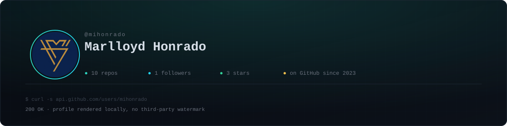
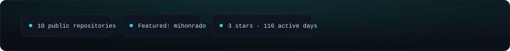
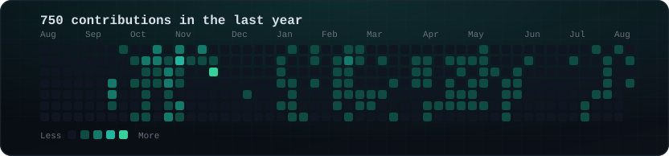
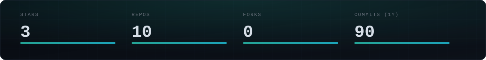
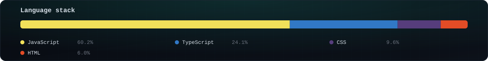
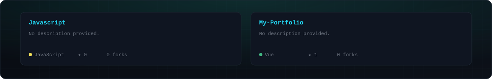

  

<a href="https://github.com/mihonrado">GitHub</a>

  

### The year, so far

  

### Signal

  

  

### Work

  

### Profile scan

  

  Marlloyd Honrado · every panel is a self-hosted SVG generated from live GitHub data · auto-refreshed daily via GitHub Actions

